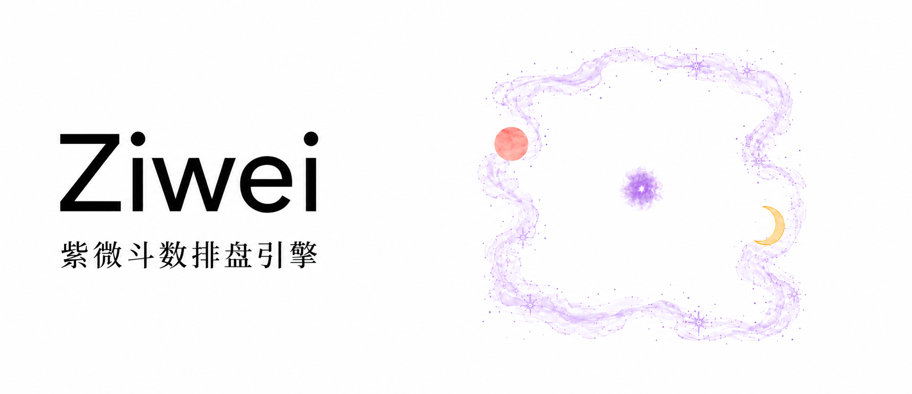

<picture>
  <source media="(prefers-color-scheme: dark)" srcset="../../assets/ziwei-banner-dark.png">
  <source media="(prefers-color-scheme: light)" srcset="../../assets/ziwei-banner-light.png">
  
</picture>

<h1 align="center">@matharts/ziwei</h1>

<p align="center">
  <strong>输入农历出生资料，查询宫位、星曜与四化。</strong><br>
  在 Node.js／TypeScript 中使用 Rust 排盘引擎。
</p>

<p align="center">
  <a href="#范围"></a>
  <a href="package.json"></a>
  <a href="../../LICENSE"></a>
</p>

<p align="center">
  <a href="#安装">安装</a> &nbsp; / &nbsp;
  <a href="#使用">使用</a> &nbsp; / &nbsp;
  <a href="#进阶用法">进阶用法</a> &nbsp; / &nbsp;
  <a href="#范围">范围</a>
</p>

> [!NOTE]
> **尚未发布到 npm** · 当前通过本地包接入，接口与功能仍可能调整。

## 安装

需要 Node.js **24.15.0 或更高版本**。当前没有 npm 发布版本，取得与运行平台匹配的本地包（`.tgz`）后，在应用项目中安装：

```sh
pnpm add /path/to/matharts-ziwei.tgz
```

将路径替换为实际文件位置。上述示例适用于包含原生二进制的自包含本地包，需要匹配的操作系统、CPU 架构和运行环境；不能将同一份包用于所有平台。

拆分分发的主包与平台包是另一种格式：主包不含原生二进制，必须同时提供匹配的平台包。平台包尚未发布，当前不能仅安装拆分主包，也尚无可直接从 npm 安装的版本。

## 使用

通过 `Ziwei.fromBirth` 同步创建本命盘。在已安装本包的应用项目中，将以下代码保存为 `example.ts`：

```ts
import { Ziwei, Gender, Branch, StarName } from '@matharts/ziwei';

const natal = Ziwei.fromBirth({
  gender: Gender.Male,
  birthYear: 1984,
  birthMonth: 1,
  birthDay: 6,
  birthHour: Branch.Zi,
});

const palace = natal.palaceByStar(StarName.ZiWei);
console.log(palace.nameHans); // 命宫
console.log(palace.nameHant); // 命宮
console.log(natal.star(StarName.WuQu).birthTransformation); // C：化科
```

在应用项目中运行 `node example.ts`。

输入必须是已处理好的农历出生资料。`birthMonth` 为 `1..12`，`birthDay` 为 `1..30`；`birthHour` 使用十二地支，**不是 `0..23` 的钟表小时**。公历转换、闰月、时区与真太阳时等处理由调用方完成。

## 进阶用法

命盘不可变，查询同步执行，大限和流年按请求计算。下面的查询示例沿用上文的 `natal`；完整签名与返回结构见 [API 类型定义](../../docs/architecture/node-api/index.d.ts)。

<details>
<summary>已知生年干支与紫微位置：fromParameters</summary>

不提供数字年份和出生日时，使用 `Ziwei.fromParameters`。生年干支必须阴阳相配，`ziweiBranch` 是紫微所在的地支：

```ts
import { Stem } from '@matharts/ziwei';

const fromParameters = Ziwei.fromParameters({
  gender: Gender.Male,
  birthStem: Stem.Jia,
  birthBranch: Branch.Zi,
  birthMonth: 1,
  ziweiBranch: Branch.Yin,
  birthHour: Branch.Zi,
});

console.log(fromParameters.profile.birthYear); // null
console.log(fromParameters.profile.birthDay); // null
console.log(fromParameters.decadeYears(1)[0]); // { age: 16, year: null }
```

这条入口不会反推年份或出生日。出生档案中的两项同时为 `null`，但仍可查询命盘、虚岁与限运。

</details>

<details>
<summary>查询宫位、星曜与四化</summary>

按地支、宫职或星曜定位宫位，不必先读取完整十二宫。常用入口如下：

| 查询内容 | 方法 |
| --- | --- |
| 地支、宫职、星曜对应的宫位 | `palace`、`palaceByName`、`palaceByStar` |
| 命宫、身宫、来因宫、紫微所在宫 | `mingPalace`、`shenPalace`、`originPalace`、`ziweiPalace` |
| 单星、指定宫内的星曜 | `star`、`palaceStar` |
| 对宫、三方、四正 | `oppositePalace`、`sanfangPalaces`、`sizhengPalaces` |
| 生年四化、自化 | `birthTransformations`、`selfTransformations` |
| 宫干四化、目标宫的四化来源 | `palaceTransformation`、`palaceTransformations`、`palaceTransformationSources` |

例如，读取武曲的生年四化，或检查它是否在寅宫：

```ts
console.log(natal.star(StarName.WuQu).birthTransformation); // C
console.log(natal.palaceStar(Branch.Yin, StarName.WuQu)); // null
```

`Transformation.A`／`B`／`C`／`D` 分别表示禄、权、科、忌。星曜的 `birthTransformation` 与 `selfTransformations.inward`／`outward` 分别保留生年四化、向心自化和离心自化；缺失时均为 `null`。

</details>

<details>
<summary>按需查询大限与流年</summary>

大限序号为 `0..11`，`0` 表示第一大限；流年序号为该大限内的 `0..9`。年龄使用虚岁，`decadeAgeRange` 的起止两端均包含。

```ts
import { PalaceName } from '@matharts/ziwei';

console.log(natal.periodIndicesAtAge(16)); // { decade: 1, yearly: 0 }
console.log(natal.decadeYears(1)[0]); // { age: 16, year: 1999 }
console.log(natal.yearlyByBranch(1, 9, Branch.Zi).nameHans); // 流命

const decadeMing = natal.decadePalaceByName(1, PalaceName.Ming);
console.log(decadeMing.name); // FuMu：大限命宫对应的本命父母宫
```

`decade`／`yearly` 返回十二宫的期间宫职，`decadeByBranch`／`yearlyByBranch` 查询单宫。它们不覆盖本命宫职；`decadePalaceByName`／`yearlyPalaceByName` 则定位并返回对应的本命 `Palace`。

合法虚岁未落入覆盖的大限时，`periodIndicesAtAge` 返回 `null`。不预先计算全部限运。

</details>

<details>
<summary>读取简繁名称、身份常量与十二宫</summary>

宫位和星曜的 `name` 用于程序判断，`nameHans`／`nameHant` 用于简体／繁体显示；星曜另有 `abbrHans`／`abbrHant` 简称，无需设置全局语言。

```ts
for (const palace of natal.palaces) {
  console.log(palace.nameHans, palace.stars.map(star => star.nameHans));
}
```

`Stem`、`Branch`、`PalaceName`、`StarName`、`Transformation` 提供只读 `ALL`。需要派生身份时，使用 `Gender.yinYang`、`Stem.yinYang`、`Branch.yinYang` 或 `Branch.zodiac`。

注意区分地支值与宫位数组位置：

| 数据 | 顺序或含义 |
| --- | --- |
| `Stem.ALL` | 甲至癸，值为 `0..9` |
| `Branch.ALL` | 子至亥，值为 `0..11` |
| `natal.palaces` | 寅至丑，首项为寅宫 |
| `natal.zodiac` | 生肖身份，例如 `Zodiac.Rat` |
| `natal.fiveElementBureau` | 五行局身份，值为 `2`、`3`、`4`、`5`、`6` |

按地支取宫位请使用 `natal.palace(branch)`，不要把地支值直接当作 `palaces` 下标。

</details>

<details>
<summary>只读数据、结果复用与 JSON</summary>

`profile` 和 `palaces` 首次成功读取后分别深层冻结、按命盘实例保存；重复读取保持同一引用，不同命盘之间不共享。其他查询返回独立的深层只读数据，不缓存，也不保证多次调用的结果引用相等。

`toJSON` 返回深层只读的 `NatalSnapshot`。`JSON.stringify(natal)` 自动调用这个出口：

```ts
const snapshot = natal.toJSON();
console.log(snapshot.originPalaceBranch); // 10：戌

const json = JSON.stringify(natal);
```

快照包含出生档案、生肖、五行局、十二宫和四个定位地支，不包含查询方法、原生句柄、输入来源或预计算限运。JSON／结构化克隆往返不会保留冻结状态，也不会恢复命盘的查询能力。

</details>

<details>
<summary>处理错误与未命中结果</summary>

无效输入抛出 `ZiweiError`，使用中文 `message` 说明原因，并通过只读 `code` 和判别联合 `detail` 提供结构化信息。不要解析错误文案来判断错误类型：

```ts
import { ZiweiError } from '@matharts/ziwei';

try {
  natal.decade(12);
} catch (error) {
  if (!(error instanceof ZiweiError)) throw error;
  console.error(error.code, error.message, error.detail);
}
```

`palaceStar` 在指定宫内找不到星曜时返回 `null`，不抛错。非法接收者与意外宿主异常原样传播，不包装成领域错误。

</details>

## 范围

本包支持两条建盘入口、本命数据与查询、生年四化与双向自化、宫干四化，以及按需大限／流年。不提供连续飞化、解释或断语，暂不支持流月／流日／流时。

模块只从包根导出，默认使用 ESM，也可通过 Node 的 `require('@matharts/ziwei')` 读取同一组命名导出；不提供默认导出、单独 CJS 构建、公开命盘构造器或内部子路径。

当前已在 Node 24.21.0 下验证 macOS、Windows 的 x64／arm64，以及 Linux 的 x64／arm64 × glibc／musl，共八种环境；Linux x64 glibc 另验证了最低 Node 24.15.0。Linux musl 仍受 Node 运行时实验性支持的限制，最低操作系统版本尚未承诺。

尚未发布跨平台预编译包。Node 22 不在支持范围，Node 26 与其他平台尚未验证；本包不能直接在浏览器中运行。

## License

[MIT](../../LICENSE)
